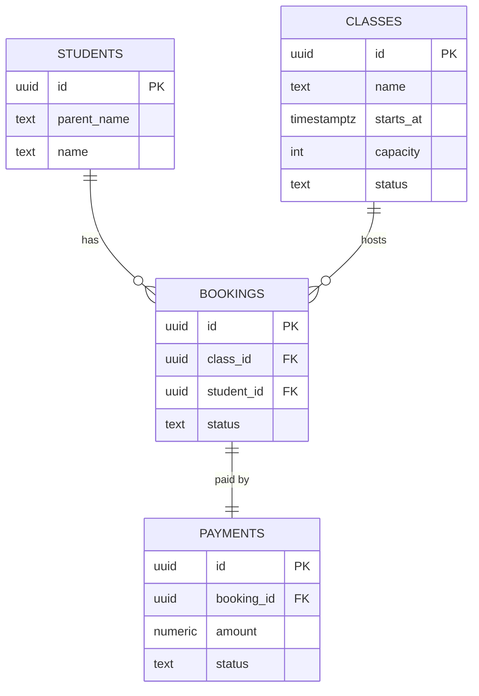
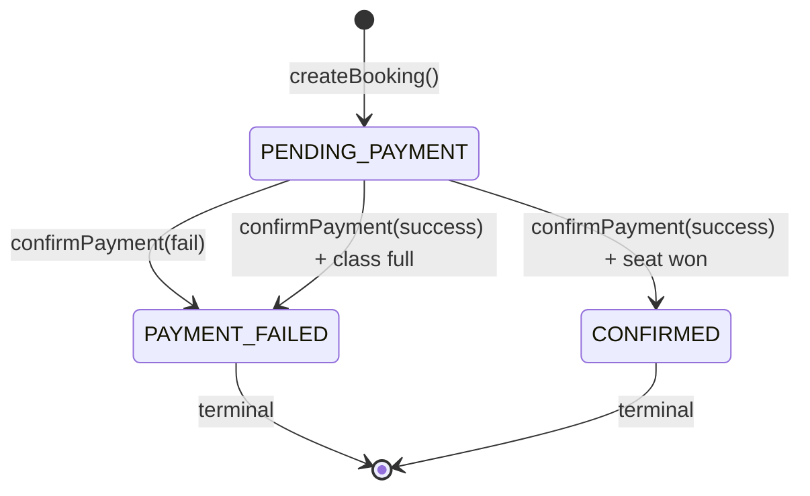
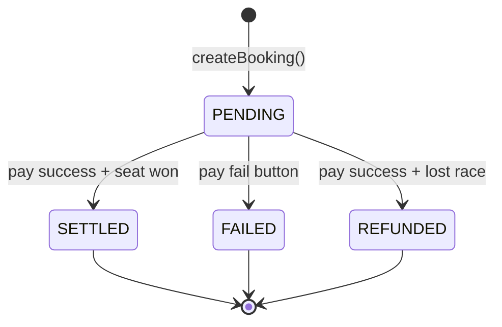
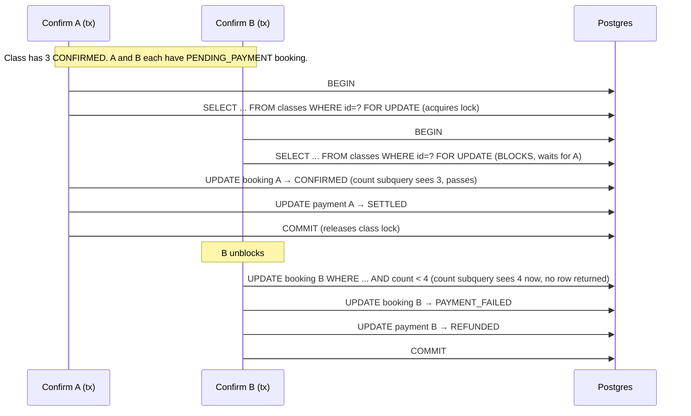

# Architecture

## Schema

```sql
CREATE TABLE students (
  id           uuid PRIMARY KEY DEFAULT gen_random_uuid(),
  parent_name  text NOT NULL,
  name         text NOT NULL,
  created_at   timestamptz NOT NULL DEFAULT now()
);

CREATE TABLE classes (
  id           uuid PRIMARY KEY DEFAULT gen_random_uuid(),
  name         text NOT NULL,
  starts_at    timestamptz NOT NULL,
  capacity     int  NOT NULL DEFAULT 4,
  status       text NOT NULL DEFAULT 'OPEN'
    CHECK (status IN ('OPEN', 'CLOSED', 'CANCELLED')),
  created_at   timestamptz NOT NULL DEFAULT now()
);

CREATE TABLE bookings (
  id           uuid PRIMARY KEY DEFAULT gen_random_uuid(),
  class_id     uuid NOT NULL REFERENCES classes(id),
  student_id   uuid NOT NULL REFERENCES students(id),
  status       text NOT NULL
    CHECK (status IN ('PENDING_PAYMENT', 'CONFIRMED', 'PAYMENT_FAILED', 'CANCELLED')),
  created_at   timestamptz NOT NULL DEFAULT now(),
  updated_at   timestamptz NOT NULL DEFAULT now()
);

CREATE UNIQUE INDEX bookings_active_unique
  ON bookings (class_id, student_id)
  WHERE status IN ('PENDING_PAYMENT', 'CONFIRMED');

CREATE INDEX bookings_class_status_idx ON bookings (class_id, status);

CREATE TABLE payments (
  id           uuid PRIMARY KEY DEFAULT gen_random_uuid(),
  booking_id   uuid NOT NULL UNIQUE REFERENCES bookings(id),
  amount       numeric(10,2) NOT NULL DEFAULT 0,
  status       text NOT NULL
    CHECK (status IN ('PENDING', 'SETTLED', 'FAILED', 'REFUNDED')),
  created_at   timestamptz NOT NULL DEFAULT now(),
  updated_at   timestamptz NOT NULL DEFAULT now()
);
```

### ER diagram



### Why no `confirmed_count` column on classes

A counter drifts. If anything bypasses the flow, the count lies. `COUNT(*)` from the bookings table cannot drift. At 4-seat classes it's trivially cheap (uses `bookings_class_status_idx`).

### Why partial unique index (not full unique)

A student whose payment failed should be able to re-book. Full unique on `(class_id, student_id)` would block that forever. Partial index only blocks while the booking is active.

## State machines

### Booking



`CANCELLED` reserved for future use (admin cancels a class). Not implemented.

### Payment



## Server actions (in `app/actions/`)

```
createBooking(studentId, classId)
  → sql.begin: INSERT booking (PENDING_PAYMENT) + payment (PENDING)
  → Partial unique index catches duplicate active booking
  → Catch SQLSTATE 23505 → { ok: false, code: 'DUPLICATE_ACTIVE_BOOKING' }

confirmPayment(paymentId, result: 'success' | 'fail')
  → 'fail':    sql.begin: booking → PAYMENT_FAILED, payment → FAILED
  → 'success': sql.begin (see below)

listAvailableClasses()
  → classes with status=OPEN and CONFIRMED count < capacity (UX only)

getBookingStatus(bookingId)
  → booking + payment state

getClassRoster(classId)   [admin]
  → CONFIRMED bookings + student names
```

## The last-seat race — CRITICAL

### The problem

Two parents on the last seat. Each has their own PENDING_PAYMENT booking (different `booking.id`). Both click "Pay success" at the same time.

Naive design: `UPDATE bookings ... WHERE ... AND (SELECT COUNT(*) ...) < 4` on booking id.

**Why the naive design is broken:** The UPDATE takes a row lock on the booking row it targets. Two different bookings = two different row locks = **no contention**. Under READ COMMITTED, each transaction's `COUNT(*)` subquery reads a per-statement snapshot taken *before* either commits. Both see count=3, both pass the `< 4` guard, both commit. Result: 5 CONFIRMED bookings on a 4-seat class. 

### The fix — SELECT FOR UPDATE on the classes row

Serialize all confirmations for one class on a lock we hold ourselves — the classes row.

```sql
BEGIN;
  -- Serialization point: hold lock on the classes row for this confirm.
  -- Held for milliseconds — NOT across the payment call, only across this write.
  SELECT id FROM classes WHERE id = $class_id FOR UPDATE;

  UPDATE bookings
  SET status = 'CONFIRMED', updated_at = now()
  WHERE id = $booking_id
    AND status = 'PENDING_PAYMENT'
    AND (SELECT COUNT(*) FROM bookings
         WHERE class_id = $class_id AND status = 'CONFIRMED') < 4
  RETURNING id;

  -- If row returned: UPDATE payment → SETTLED
  -- If no row:       UPDATE booking → PAYMENT_FAILED, payment → REFUNDED
COMMIT;
```

The `SELECT FOR UPDATE` on the classes row is an exclusive lock. Only one transaction can hold it at a time; the second waits. When the second acquires it, the first has already committed → its `COUNT(*)` now sees the correct state (4) and its UPDATE returns no row → correctly rejected as CLASS_FULL.

### Sequence



### Why not other approaches

- **`SELECT FOR UPDATE` on the classes row held across the payment call** — payment takes seconds. Holding a DB lock across an external call risks deadlock and pool exhaustion. **The lock here is inside the confirm-only transaction, after payment returned. Duration: single-digit ms.**
- **SERIALIZABLE isolation + retry loop** — correct but heavier and needs retry orchestration. Overkill.
- **Advisory lock** (`pg_advisory_xact_lock(hashtext(class_id::text))`) — equivalent semantics, but reviewers less familiar. FOR UPDATE on classes is idiomatic.
- **`confirmed_count` counter column on classes** — also correct (two UPDATEs on the same class row serialize on that row's lock), but needs a schema change and drift protection. FOR UPDATE on the existing row is zero schema change.

### Isolation level

Default `READ COMMITTED` is sufficient once `SELECT FOR UPDATE` is in place. The serialization comes from the row lock, not the isolation level.

## Trust boundaries

| Check | UI | Backend | DB | Rationale |
|---|:-:|:-:|:-:|---|
| Class has available seats (list view) | ✓ | ✓ | — | UX only, not a correctness gate |
| Student already has active booking | ✓ | ✓ | ✓ | Fail fast in UI, DB is the guarantee |
| Confirmed count < 4 | — | — | ✓ | Only DB (via FOR UPDATE + count) can guarantee under concurrency |
| Payment result recorded | — | ✓ | — | Backend orchestrates transitions |
| Booking status transitions valid | — | ✓ | ✓ (CHECK) | Both defend, DB is last line |

**Rule of thumb:** UI checks are UX. Backend checks are ergonomics. Database checks are guarantees.

## Observability (state in README, don't implement)

- Rate of `PAYMENT_FAILED` with reason `CLASS_FULL` — spike means UX pre-check is stale
- Rate of duplicate-booking rejections — client retry bugs
- Payment settlement latency p99 — wider window = more race hits
- `SELECT class_id, COUNT(*) FROM bookings WHERE status='CONFIRMED' GROUP BY class_id HAVING COUNT(*) > 4` — must always be empty
